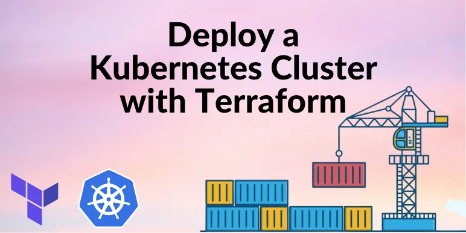
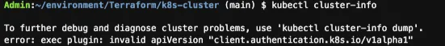
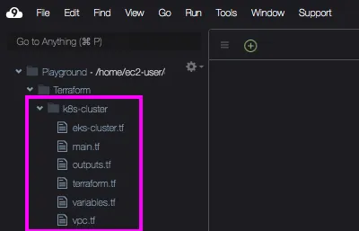

Deploy a Kubernetes Cluster with Terraform
------------------------------------------

* This is a quick tutorial to demonstrate how to use Terraform to provision a Kubernetes cluster in AWS EKS.


### Prerequisites:
* AWS account
* Kubernetes CLI installed
* Kubectl installed
* AWS CLI installed
* Terraform installed
* Basic Terraform knowledge and experience
* Basic Kubernetes knowledge and experience
* Cloud9 or similar IDE

### Objectives:
* Set up AWS credentials
* Install kubectl (if not already done)
* Configure working directory
* Edit .tf files to create Kubernetes cluster infrastructure
* Deploy the Kubernetes cluster
* Clean up

### Benefits of using Terraform with Kubernetes
* Terraform can be used to create code that provisions all sorts of resources, including Kubernetes clusters. 
* Terraform provides a unified workflow that allows for full resource lifecycle management. 
* In addition, the use of reusable modules simplifies the infrastructure creation process and reduces provisioning time.

### Install kubectl
* Use the following command to check if you already have kubectl installed in your IDE:
```
kubectl version --short--client
```

* If you do not have kubectl installed yet, follow [Refer Here](https://docs.aws.amazon.com/eks/latest/userguide/install-kubectl.html) for the commands of installing kubectl.
* However let me preface this with a warning to read this entire section before installing. 
* First, determine what OS your instance is running on and follow the commands for that particular OS. 
* If using Cloud9, you can find your OS type by clicking on the EC2 instance running your Cloud9 environment, then looking under Platform. 
* My instance is running on Linux so I used the Linux installation commands.

* I followed the Linux installation instructions from [Refer Here](https://docs.aws.amazon.com/eks/latest/userguide/install-kubectl.html) to install version 1.26.1 of kubectl. 
* It seemed like it worked, until I got later down the road after I had created my EKS cluster and connected it to kubectl (this is done in a later step of this tutorial). 
* After connecting my cluster and checking the cluster info, I got this error:


* I learned that kubectl was trying to use an API version that was not supported by my EKS cluster. 
* To fix this, I followed [Refer Here](https://k21academy.com/docker-kubernetes/kubernetes-developer/solving-kubectl-commands-results-in-error-exec-plugin-invalid-apiversion/) and instead installed an earlier version of kubectl (version 1.23.15). 
* My EKS cluster was able to run with this kubectl version. 
* So, to install kubectl, I would recommend you follow these commands:

```
#Install or update kubectl on Linux 
curl -O https://s3.us-west-2.amazonaws.com/amazon-eks/1.23.15/2023-01-11/bin/linux/amd64/kubectl

#Apply execute permissions to the binary
chmod +x ./kubectl

#Copy the binary to a folder in your PATH
mkdir -p $HOME/bin && cp ./kubectl $HOME/bin/kubectl && export PATH=$PATH:$HOME/bin

#(Optional) Add the $HOME/bin path to your shell initialization file so that it is configured when you open a shell.
echo 'export PATH=$PATH:$HOME/bin' >> ~/.bashrc

#After you install kubectl, you can verify its version.
kubectl version --short --client
```

* Hopefully this will save you some headache down the road. As time goes on and versions change, they may need to be updated again.


### Configure Working Directory
* Create a new directory where you want to house your project, then navigate to the directory and create the following files:

* terraform.tf
* variables.tf
* vpc.tf
* outputs.tf
* eks-cluster.tf
* main.tf

* Your directory should look like this:


### Deploy Kubernetes Cluster with Terraform
* To deploy the Kubernetes cluster, we must first initialize the backend, modules, and provider plugins that we defined in our code. 
* Because we didn’t explicitly define a backend, Terraform will use the local backend. 
* Run the following command:
```
terraform init
```

* Check your configuration file syntax using the following command:
```
terraform validate
```

* You can optionally run the following command to see a plan of the resources that will be created based on your infrastructure code:
```
terraform plan
```

* Next provision the resources using the following command:
```
terraform apply -auto-approve
```

* It can take a while to provision an EKS cluster (usually 10 to 15 minutes), so go grab a coffee or water, take a walk outside, and come back.

### Configure kubectl

* After creating your cluster, you need to configure kubectl to be able to interact with it. You can do this using the following command:
```
aws eks update-kubeconfig --region <region> --name <EKS_cluster_name>
```

* Replace <region> and EKS_cluster_name> with the region you’re working in and the name that was created for the cluster. You can pull this name from your outputs in your CLI.


* Run the following command to obtain some information about the cluster you just created:
```
kubectl cluster-info
```

<!-- * If you get an API error like this one, revisit the Install kubectl section of this tutorial to see how I resolved this error.


* If you do not get an error, your CLI should look like this: -->


* This shows that our cluster is running. Use the following command to see the nodes that were created:
```
kubectl get nodes
```

* If you want, you can also go to the AWS EKS console to verify your cluster and nodes were created:

### Conclusion and Clean Up

* In this brief tutorial, we used Terraform code to provision a Kubernetes cluster in AWS EKS. 
* In a later tutorial we will deploy an application in the cluster that we created. 
* For now, go ahead and clean up your resources using the following command:
```
terraform destroy
```

* THANK YOU FOR READING!


